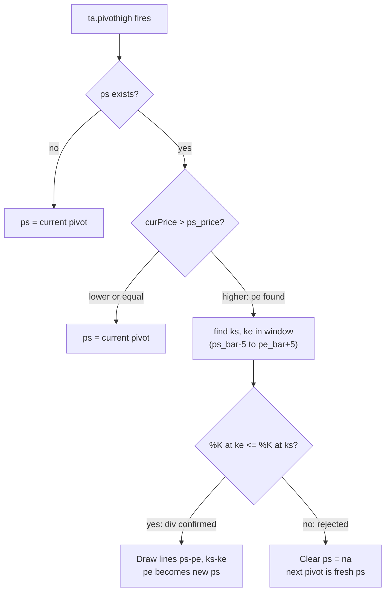

# Rewrite Stoch RSI Divergence Indicator

Target file: [indicators/stoch_rsi_divergence.pine](indicators/stoch_rsi_divergence.pine)

## What gets removed (~350 lines)

- **6 helper functions** (lines 67-299): `k_peak_around`, `k_trough_around`, `k_peak_around_after_anchor`, `k_trough_around_after_anchor`, `k_peak_bear_leg`, `k_trough_bull_leg`
- **2 cross-validation functions** (lines 301-364): `stoch_peak_validated_bear`, `stoch_peak_validated_bull`
- **All "pending div" / deferred-draw state** (lines 370-374, 466-480)
- **Inputs dropped**: `minKDiff`, `minKBear`, `maxKBull`, `kPeakWin`, `requireCross`, `debugPhH`
- **Debug shapes/barcolor** (lines 379-381)

## What stays (unchanged)

- Stoch RSI inputs (`smoothK`, `smoothD`, `lengthRSI`, `lengthStoch`, `src`)
- Divergence toggle (`showDiv`), lookbacks (`lbL=5`, `lbR=3`), line colors
- Stoch RSI calculation (`rsi1`, `k`, `d`, `max_bars_back`)
- Plotting (`k`, `d`, bands 20/50/80, fill)
- `indicator()` declaration with `max_lines_count=500`, `max_bars_back=5000`

## New code structure

### 1. Header comment
Rewrite to match the simplified spec (README steps 1-7).

### 2. Helper: `is_k_swing_high(barIdx, left, right)`
Given an absolute bar index, return true if `k` at that bar is strictly greater than `k` at each of the `left` bars before and `right` bars after. Symmetric `is_k_swing_low` for bull div.

### 3. Helper: `find_k_anchor_bear(pricePivotBar, winLo, winHi)`
Scan `[winLo, winHi]` for:
- **Priority 1**: %K swing highs (`is_k_swing_high` with `lbL`/`lbR`). If multiple, pick the one **closest** to `pricePivotBar`.
- **Fallback**: bars where K crosses down through D. Pick the one **closest** to `pricePivotBar`.
- Return `[kValue, kBar]`.

Symmetric `find_k_anchor_bull` uses `is_k_swing_low` and K-cross-up-through-D.

### 4. Bear div state machine

```
var int bear_ps_bar = na, var float bear_ps_price = na
```

On each `ta.pivothigh(high, lbL, lbR)`:
- `curBar = bar_index - lbR`, `curPrice = phH`
- If `bear_ps_bar` is `na` -> set ps = current pivot, done.
- If `curPrice > bear_ps_price` -> this is pe, run divergence check:
  - `winLo = bear_ps_bar - 5`, `winHi = curBar + 5` (clamped to 0 / bar_index)
  - `[ksVal, ksBar] = find_k_anchor_bear(bear_ps_bar, winLo, winHi)`
  - `[keVal, keBar] = find_k_anchor_bear(curBar, winLo, winHi)` with constraint `keBar != ksBar`
  - If `keVal <= ksVal` -> draw ps-pe on price, ks-ke on indicator; pe becomes new ps.
  - Else -> clear ps (set `na`), next pivot starts fresh.
- If `curPrice <= bear_ps_price` -> replace ps with current pivot.

### 5. Bull div state machine (symmetric)

```
var int bull_ps_bar = na, var float bull_ps_price = na
```

On each `ta.pivotlow(low, lbL, lbR)`:
- If ps is `na` -> set ps.
- If `curPrice < bull_ps_price` -> this is pe, check divergence:
  - `find_k_anchor_bull` for ks (closest to ps) and ke (closest to pe, != ks)
  - If `keVal >= ksVal` -> draw, pe becomes new ps.
  - Else -> clear ps.
- If `curPrice >= bull_ps_price` -> replace ps.

### 6. ke != ks enforcement
In `find_k_anchor_bear` / `find_k_anchor_bull`, pass an `excludeBar` parameter so ke's search skips the bar already chosen for ks. Alternatively, call the function twice: once for ks, then for ke with exclusion.

## Flow diagram



## Follow-up changes (consolidated)

- Cross-only anchor experiment was applied and validated, then superseded.
- Final anchor behavior in current code:
  - `ks` = `%K` pivot closest to `ps`
  - `ke` = `%K` pivot closest to `pe`
  - `ke != ks` enforced via `excludeBar`.
- Pivot strictness was relaxed to allow equal neighboring `%K` values (only reject strictly greater/less neighbors), restoring divergence line visibility.
- TradingView automation was added (`sync-pine-to-tv.cjs`) and reused by watch mode.
